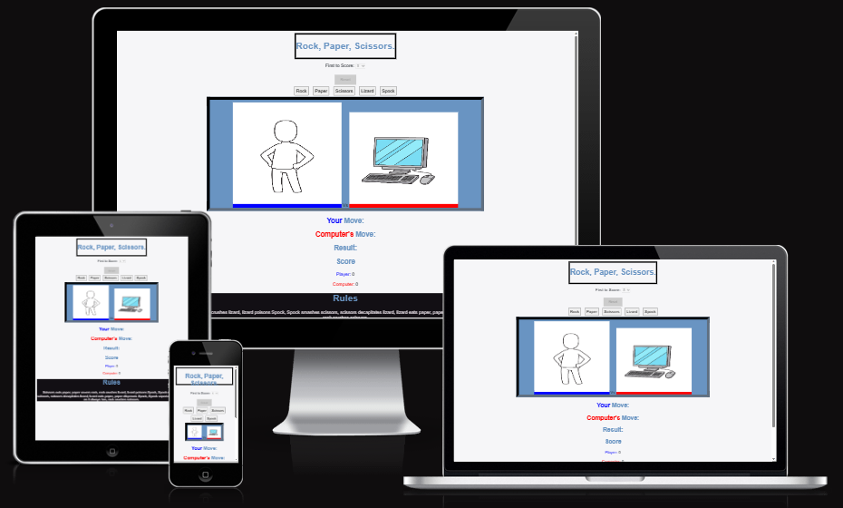
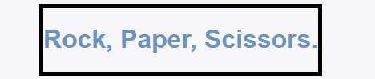
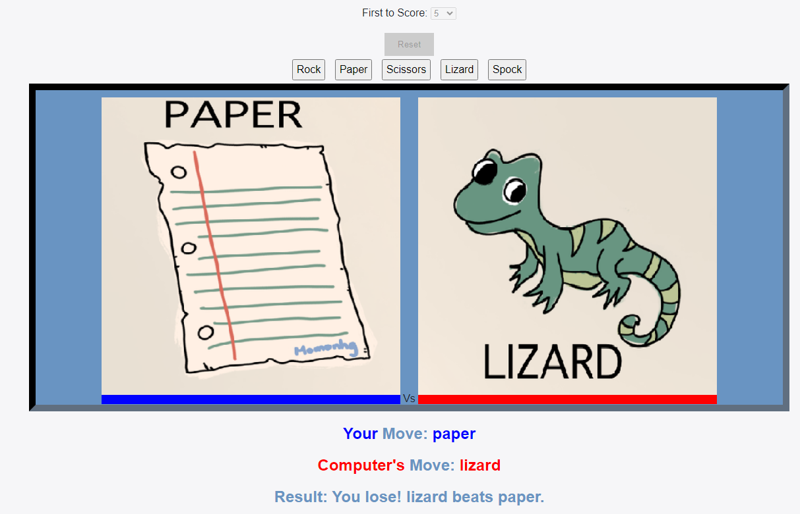

# Rock Paper Scissors Lizard Spock
Rock Paper Scissors is a site that allows the user to play vs a computer with a game of different lengths and against an opponent that chooses options randomly.
The site is targeted towards people who enjoy games of chance with no consequences and gives them the ability to choose and decide how long they play for.

## Features 

### Existing Features

- __The Rock Paper Scissors Heading__

  - Featured at the top of the page, the Rock paper scissors heading is easy to see for the user. Upon viewing the page, the user will be able to see the name of the game.

- __The Game Area__

  -  This area allows people to select what to play, what the computer has also played, and how long they want to play for.
  - Allowing the player to interact and show effective user design in showing the users actions and giving them control
  - It highlights the move each player and computer made in a round with a graphic and highlighted text for ease of clarity

- __The Image Area__

  - This section will show with the help of Javascript, a graphic that updates when the player or computer have selected a choice

- __The Score Board__

  - This section updates after every round of play
  - It shows the score in highlighted colors for ease of clarity and also explains how, and why you lost/won a round

### Features Left to Implement

- A score board using local.data that shows how many games you have played and how many you have won. 
- A score submition which allows people to submit their scores to the leaderboard
- A username interface which allows players to be unique
- A multiplayer option which allows players over the internet to play against each other, in delayed or real time.
## Testing 

- __User Experience__

 -  The user loads up the site and immediately sees the name of the website, the buttons available and if they scroll to the bottom they can see the rules of the game.
 - By selecting an option they can begin the rounds of play, which for the first time visitor is set to 5, but after their first game they are able to modify that.
 - The score board and move selector are highlighted in different colors to better help identify and for ease of clarity.
 - The moves are also explained using text for help with screen readers.

- __Manual Testing__

- Each button operates and gives visual feed back to the player.
- When the maximum score is reached the reset and round select buttons become accessible and the play buttons become disabled.
- after selecting either a round of play or the reset button play resumes.

### Validator Testing 

- HTML
    - No errors were returned when passing through the official [W3C validator](https://validator.w3.org/nu/?doc=https%3A%2F%2Fcode-institute-org.github.io%2Flove-maths%2F)
- CSS
    - No errors were found when passing through the official [(Jigsaw) validator](https://jigsaw.w3.org/css-validator/validator?uri=https%3A%2F%2Fvalidator.w3.org%2Fnu%2F%3Fdoc%3Dhttps%253A%252F%252Fcode-institute-org.github.io%252Flove-maths%252F&profile=css3svg&usermedium=all&warning=1&vextwarning=&lang=en)
- JavaScript
    Metrics
- There are 11 functions in this file.

- Function with the largest signature take 3 arguments, while the median is 1.

- Largest function has 25 statements in it, while the median is 4.

- The most complex function has a cyclomatic complexity value of 19 while the median is 1.

- 45 warnings
### Unfixed Bugs

The Favicon i used seems to not have loaded, so either the link i have is unusable or I implemented it in the wrong way,
- also the lack of a logo, I couldnt make up my mind, and I thought the text looked cleaner but probably would have gone for an image.

## Deployment

This section should describe the process you went through to deploy the project to a hosting platform (e.g. GitHub) 

- The site was deployed to GitHub pages. The steps to deploy are as follows: 
  - In the GitHub repository, navigate to the Settings tab 
  - From the source section drop-down menu, select the Master Branch
  - Once the master branch has been selected, the page will be automatically refreshed with a detailed ribbon display to indicate the successful deployment. 

The live link can be found here - https://code-institute-org.github.io/love-maths/

## Credits 

https://www.youtube.com/watch?v=n1_vHArDBRA&t=374s&ab_channel=BroCode - This video gave me the scope of the project and what i needed to do.

https://stackoverflow.com/questions/24265123/shorthand-if-else-if-and-else-statement- This helped me figure out the short hand for else if statements

### Content

The Quote at the bottom in the rules is taken from "The Big Bang Theory"

### Media

The images I got from Google at https://www.momonhg.com/blog/rock-paper-scissors-lizard-and-spock-game + https://iheartcraftythings.com/

